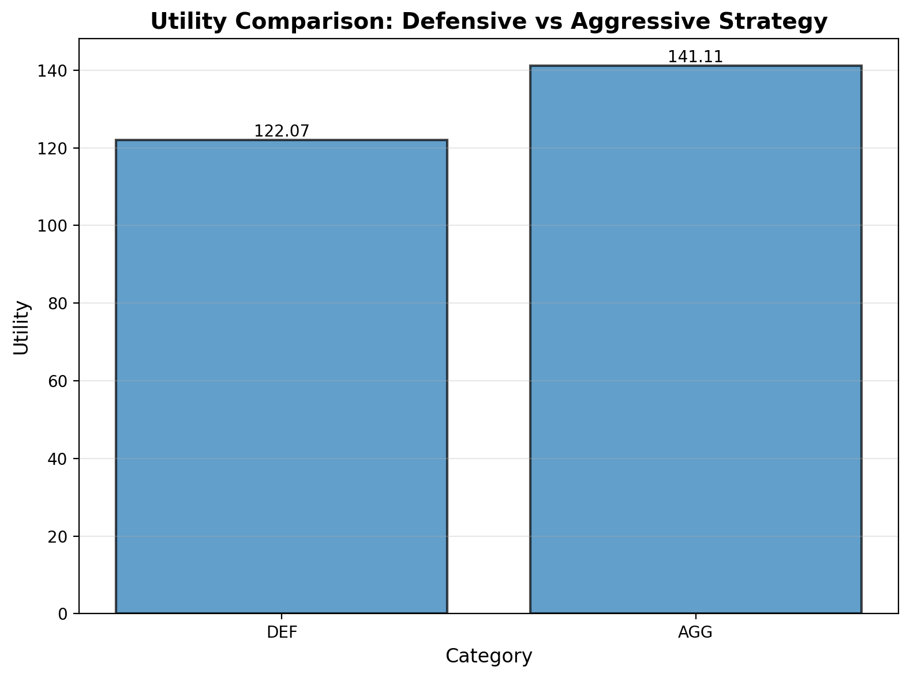
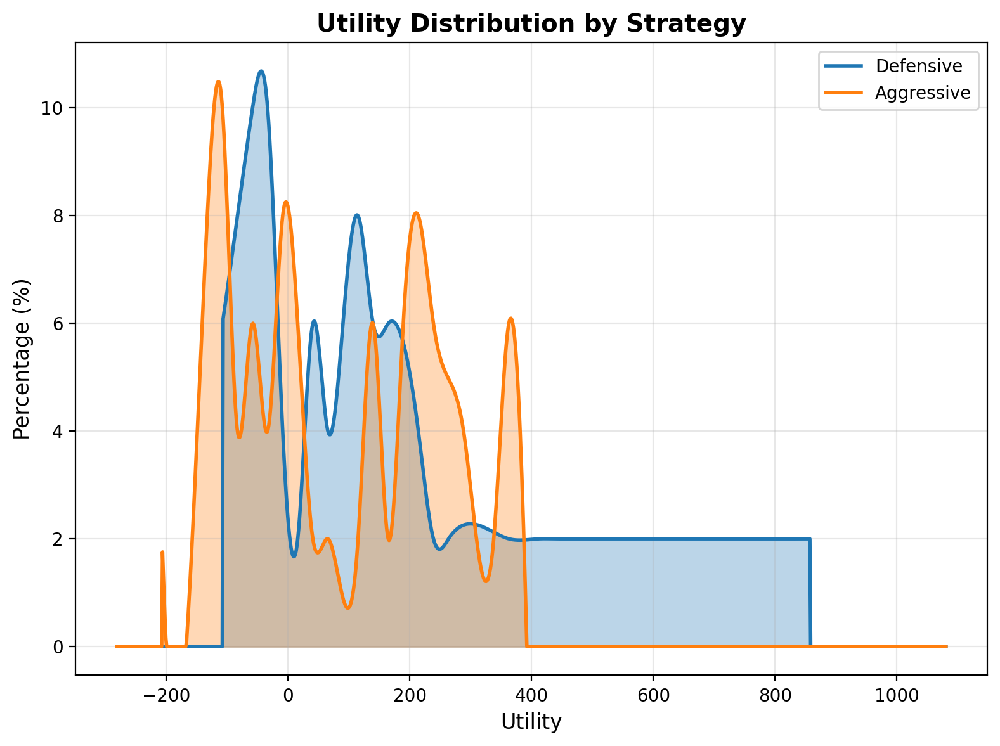
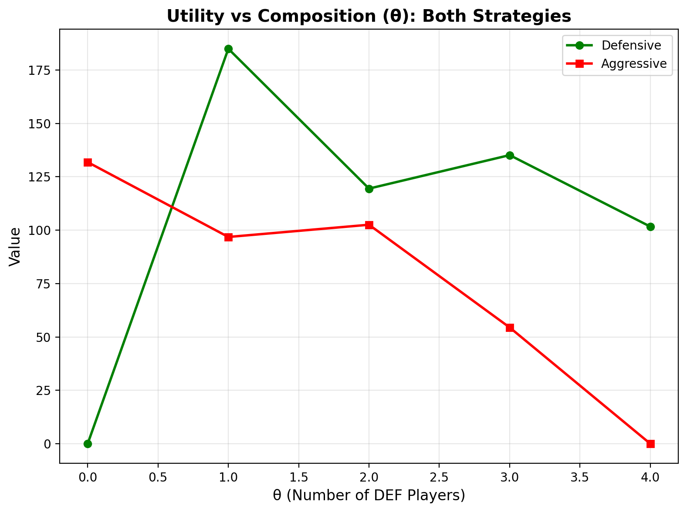
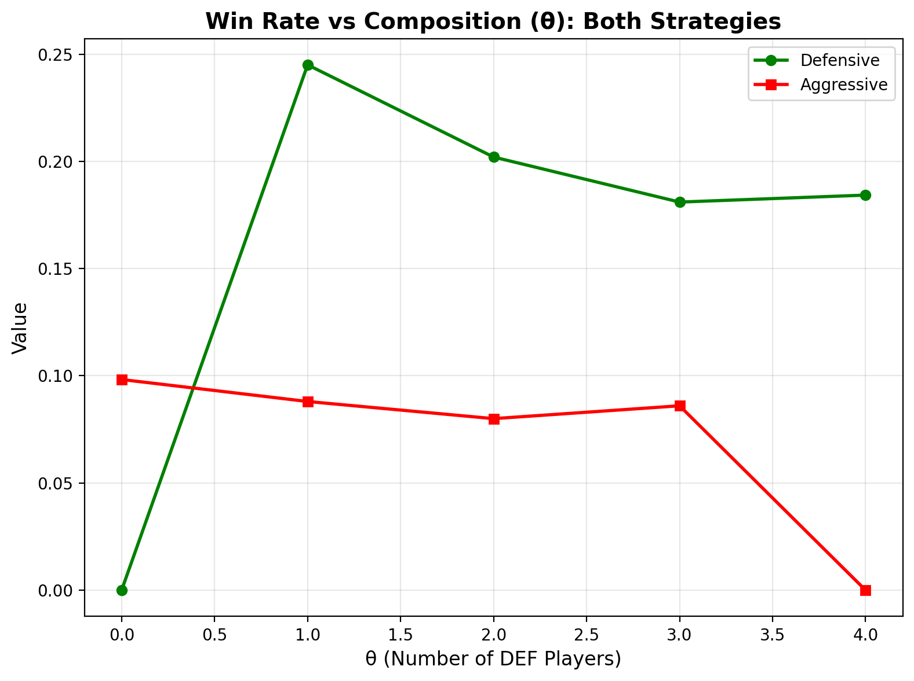

# Monte Carlo Simulation of Strategic Trade-offs in Beijing Mahjong

**Authors:** Xu(Pete) Chen, Bohan Shan  
**NetIDs:** xc74, bohans3  

---

## 🀄 Introduction

Mahjong is a traditional four-player strategy game that blends elements of probability, pattern recognition, and risk–reward decision-making.  
This project focuses on **Beijing-style Mahjong**, a ruleset widely played in northern China.  

Each player begins with **13 tiles** and draws one on each turn, discarding one until achieving a valid **14-tile winning hand (Hu)**.  
A standard winning hand must consist of **four melds (sets)** and **one pair (eyes)**, where melds can be:

- **Pongs** – three identical tiles (e.g., three 5 of Characters)  
- **Chis** – three consecutive tiles of the same suit (e.g., 3–4–5 of Dots)  
- **Gongs** – four identical tiles (a special type of Pung that yields a bonus fan)  
- The **pair (eyes)** is any two identical tiles (e.g., two Red Dragons)

Unlike southern variants such as Sichuan Mahjong that emphasize continuous rounds or “blood battle” mechanics, the **Beijing style** uses a **fan-based scoring system** with independent hands and exponential payoffs determined by the complexity of the winning pattern.

The total score for a winning hand typically follows an exponential relationship:
`Score = B × 2^fan`
where `B` is a fixed base point (e.g., 2 or 4).

---

## 🚀 Getting Started

### Installation

1. Clone the repository
2. Install dependencies:
```bash
pip install -r requirements.txt
```

### Configuration

All simulation parameters are configured in `configs/base.yaml`:

```yaml
base_points: 10              # Base point value for scoring (B in Score = B * 2^fan)
fan_min: 1                  # Minimum fan for defensive strategy (Pi Hu = 1 fan)
t_fan_threshold: 3          # Fan threshold for aggressive strategy
alpha: 0.5                  # Utility weight parameter (missing_hu utility)
penalty_deal_in: 3          # Deal-in penalty multiplier
rounds_per_trial: 20        # Number of rounds per trial
trials: 50                  # Number of trials to run (beyong 50 trails for the senitivity experiment is time consuming)
baseline_utility: 50        # Starting utility value (added to cumulative utility)

```

### Running Experiments

**Run a specific experiment:**
```bash
python main.py --experiment 1    # Strategy comparison
python main.py --experiment 3    # Table composition analysis
python main.py --experiment 4    # Sensitivity analysis
```

**Run all experiments (runs experiments 1 and 3):**
```bash
python main.py --all
```

Note: Experiment 4 (sensitivity analysis) is not included in `--all` and because it takes longer time

### Running Tests

**Run all tests with coverage:**
```bash
pytest pytest/ --cov=mahjong_sim --cov-report=term-missing --cov-report=html
```

**Run tests without coverage:**
```bash
pytest pytest/ -v
```

**View coverage report:**
```bash
open htmlcov/index.html
```


---

## 📁 Project Structure

```
597PRFINAL/
├── configs/
│   └── base.yaml              # Configuration file for all experiments
├── experiments/
│   ├── run_experiment_1.py   # Strategy comparison experiment
│   ├── run_experiment_3_table.py  # Table composition analysis
│   └── run_sensitivity.py    # Sensitivity analysis
├── mahjong_sim/
│   ├── __init__.py
│   ├── real_mc.py            # Core Monte Carlo simulation engine
│   ├── scoring.py            # Scoring functions (score, profit, cost)
│   ├── strategies.py         # Strategy functions (defensive/aggressive)
│   ├── players.py            # Player classes and NeutralPolicy
│   ├── utils.py              # Statistical utilities and comparisons
│   └── plotting.py           # Visualization functions
├── pytest/                    # Test suite
│   ├── test_simulation.py     # Basic simulation tests
│   ├── test_simulation_extended.py  # Extended simulation tests
│   ├── test_strategies.py    # Strategy function tests
│   ├── test_scoring.py       # Scoring function tests
│   ├── test_players.py       # Player and NeutralPolicy tests
│   ├── test_table.py         # Table simulation tests
│   └── test_utils.py          # Utility and statistics tests
├── output/                    # Experiment output files
├── plots/                     # Generated plots and visualizations
├── main.py                    # Main entry point for running experiments
├── pytest.ini                 # Pytest configuration
└── requirements.txt           # Python dependencies
```

---

### Common Fan Sources in Beijing Rules

| **Category** | **Example** | **Fan Value** |
|---------------|-------------|----------------|
| **Basic hand** | Self-draw, Concealed hand, All simples | 1 fan |
| **Common wins** | All pongs, Mixed triple chow | 2 fan |
| **Advanced hands** | Pure flush, Little dragons | 4–6 fan |
| **Add-on bonuses** | Gong +1 fan; "Gong open" win +1 fan | Variable (1–2 fan) |

#### 1. Basic Hand — 1 Fan Each
**① Self-draw — 1 fan**  
Definition: You win by drawing the winning tile yourself.  
Requirements:  
- Winning tile must come from your own draw  
- Melds (chi/pong) do not affect this bonus
    
**② Concealed hand — 1 fan**  
Definition: You win with a completely closed hand.  
Requirements:  
- No exposed melds  
- Win may be self-draw or discard depending on rule set
  
**③ All simples — 1 fan**  
Definition: Hand contains no terminals (1 or 9) and no honours(Winds + Dragons).  
Requirements:  
- Tiles must be 2–8 only  
- Melds allowed as long as tiles meet criteria  
#### 2. Common Wins — 2 Fan Each
**④ All pongs — 2 fan**  
Definition: Hand consists of four pong/gong sets and one pair.  
Requirements:  
- Exposed or concealed allowed  
- Pair may be any tile
  
**⑤ Mixed triple chow — 2 fan**  
Definition: Same numbered chi appears in all three suits.  
Example: 4–5–6 in characters(wans), dots(tongs), and bamboos(sous)  
Requirements:  
- Three identical sequences, one in each suit  
#### 3. Advanced Hands — 4–6 Fan Each
**⑥ Pure flush — 4–6 fan**  
Definition: Whole hand uses tiles from one suit, no honours(Winds + Dragons).  
Fan range:  
- Exposed melds → lower (4 fan)  
- Fully concealed → higher (6 fan)
   
**⑦ Little dragons — 4–6 fan**  
Definition:  
- Two dragon pongs/gongs  
- Pair made from the remaining dragon  
Requirements:  
- Dragon melds may be exposed or concealed  
- Pair must be the third dragon  
#### 4. Add-on Bonuses — +1 to +2 Fan
**⑧ Gong — +1 fan**  
Definition: Gong formed by upgrading an existing Pong meld (from self-draw or discard).  
Bonus: +1 fan per gong  

**⑨ "Gong open" win — +1 fan**  
Definition: Win on the tile drawn immediately after making a gong.  
Bonus: +1 fan, added on top of gong bonuses  

---

### Pi Hu Rule and Strategy Implications

In our simulation, **Pi Hu with 1 fan is allowed** as the minimum valid winning hand.  
Traditional Beijing rules require at least one fan to declare a win, and our implementation enforces this:  
A structurally complete hand of four melds plus one pair **must have at least 1 fan to win** (0 fan is invalid).  
**Pi Hu (1 fan)** represents the most basic winning hand and is fully allowed.

This creates two key consequences for the simulation:
1. Defensive players can win with **1 fan (Pi Hu)** as soon as they reach this minimum threshold, reducing exposure to deal-in risk.  
2. Aggressive players pursue higher-fan outcomes (typically 3+ fan), choosing to continue drawing rather than accepting 1-fan Pi Hu wins.


---

## ⚙️ Methodology

This project uses a **Monte Carlo simulation** to model and compare long-term outcomes of player strategies under Beijing-style Mahjong rules.  
It does **not** involve any machine learning or predictive modeling; all results are based purely on random sampling and probabilistic reasoning.

---

### Phase 1 – Design

This project implements a **real Monte Carlo simulation** using actual tile-based gameplay mechanics.  
Each simulated round represents a complete hand among four players using a full **136-tile deck** (Wan, Tiao, Tong, Feng, Jian tiles).

**Game Mechanics:**
- **Deal:** Each player receives 13 tiles; dealer receives 14 tiles
- **Draw and Discard:** Players take turns drawing from the wall and discarding tiles
- **Player Actions:** Players can declare **Pong** (triplet from discard), **Gong** (quad, upgraded from Pung), or **Hu** (win)
- **Winning Detection:** Real pattern matching to detect valid winning hands (4 melds + 1 pair)
- **Fan Calculation:** Based on actual hand patterns (triplets, sequences, Gongs, special patterns)

**Scoring:**
Each round yields one or more winning events (self-draw or deal-in win).  
Scoring follows the Beijing Mahjong rule: `Score = B × 2^fan` where `B` is the base unit score and total fan includes bonuses from hand patterns and Gongs.  
Deal-in penalties are subtracted from the losing player's total; self-draws distribute points from all three opponents.  
The **minimum fan requirement** ensures that any hand with `Fan < 1` is invalid and yields no win. **Pi Hu with 1 fan is allowed** and represents the most basic winning hand.

---

### Phase 2 – Experiments

We define two player strategies as decision policies on when to declare a win:

- **Defensive strategy (DEF):** declares Hu immediately when `fan >= fan_min` (typically 1) and the hand is ready; minimizes further risk.  
- **Aggressive strategy (AGG):** declares Hu only if `fan >= t_fan_threshold` (for example, `t_fan_threshold = 3`); otherwise continues drawing, pursuing higher-fan hands.

Each simulation trial consists of **20 rounds per player** (configurable via `rounds_per_trial`), with multiple trials (default: 10) to obtain stable distributions.

| **Experiment** | **Variable Manipulated** | **Purpose** |
|-----------------|--------------------------|-------------|
| 1. Strategy comparison | Compare DEF vs AGG under identical conditions | Test H1 (profit difference) and H2 (utility difference with CRRA utility) |
| 3. Table composition sweep | Vary proportion of DEF players, theta = 0, 0.33, 0.67, 1 | Test H3 (composition threshold) |
| 4. Sensitivity analysis | Vary P (deal-in penalty: [1, 3, 5]), alpha ([0.1, 0.5, 0.9]), fan threshold ([1, 3, 5]), and base points ([1, 2, 4]) | Examine robustness of conclusions across parameter ranges |

**Utility function:**

The utility function uses a concave reward function with penalties. For each round, the utility change is computed as:

```
U_round(profit, fan, missed_hu, deal_in) = {
    sqrt(profit) * 3                    if profit > 0 and fan < 3
    sqrt(profit) * 3 * 2                if profit > 0 and fan >= 3
    -sqrt(|profit|) * 3                 if profit < 0
    0                                    if profit == 0
} - missed_penalty - deal_in_penalty
```

Where:
- `missed_penalty = 0.2` (penalty for missing a possible Hu)
- `deal_in_penalty = 0.5` (penalty for dealing in as loser)
- `fan`: Fan count of the winning hand (used for bonus multiplier when fan >= 3)

**Total utility per trial** is calculated as:
```
U_total = baseline_utility + Σ(U_round for all rounds)
```

Where:
- `baseline_utility = 50` (configurable in `base.yaml`) - starting utility value added to cumulative utility
- Each round's utility change (`U_round`) is computed based on that round's profit and added to the cumulative total

**Key design principles:**
- The square root function (`sqrt`) creates diminishing returns, reflecting that additional profit provides less utility gain
- The base multiplier `* 3` scales the utility to a more representative scale
- High-fan wins (fan >= 3) receive a 2x bonus multiplier, making aggressive strategies potentially more rewarding despite lower win rates
- Penalties are minimal and do not overpower the concave rewards

---

### Phase 3 – Analysis

Simulation outputs are aggregated across all trials to estimate:

- Expected profit per trial: E(Score)  
- Expected utility: E(U)  
- Variance and confidence intervals for both measures  
- Win rate, self-draw rate, and deal-in rate  
- Fan distribution (frequency of 1–16 fan outcomes)  
- Risk metrics such as maximum drawdown and ruin probability under a finite bankroll  

Statistical comparisons between strategy types use **two-sample t-tests** and **confidence intervals**.  
For composition analysis (H3), we run a **regression of profit against theta** (the proportion of defensive opponents) to detect sign changes that indicate the critical threshold of player compositions.  

All experiments use **modular Python code** and configuration-driven runs via YAML inputs.


---

## 🎯 Hypotheses

**H1:**  
Defensive players, who prioritize winning whenever possible, will achieve higher expected long-term monetary profit than aggressive players, who only win on hands meeting or exceeding a specified fan threshold.
1. From our results, we found that after 50 trials, the average profit that the defensive players earned was higher than the aggressive players, which proved our hypothesis.
   
2. Our simulation results clearly indicate that the defensive strategy is more successful in achieving victory. We found that the win rate for defensive players was significantly higher than that of aggressive players. In this simulated environment, adopting a defensive approach (focusing on stability and minimizing risk) strongly correlated with a higher frequency of winning rounds. While defensive players won more often, the advantage largely disappeared when analyzing total earnings. Despite the considerable difference in win rate, the difference in total profit between the two player types was marginal. This suggests that while aggressive players win less frequently, they have a higher probability of achieving high-scoring, high-Fan hands when they do win. This is likely due to their willingness to pursue complex, riskier hand combinations that yield significant profit spikes in single games.
   
3. The Fan distribution reveals a key distinction: at Fan value = 3, aggressive players exhibit a significantly higher win count. This outcome is likely driven by our simulation's design, as aggressive players are programmed to declare a win once they achieve the Fan_threshold of 3 or higher. Surprisingly, at the high end, specifically Fan value = 5, defensive players recorded five wins. We hypothesize that this result occurred because defensive players, when dealt exceptionally strong starting hands, capitalize on the high-Fan opportunities, leading them to outperform aggressive players at that specific upper limit.
   
   
**H2:**  
Despite potentially earning less monetary profit, aggressive players will achieve higher average utility than defensive players when utility accounts for both emotional rewards of large-hand wins and penalties for missed opportunities or deal-ins.

1. Unfortunately, our findings do not support the hypothesis. The Defensive strategy achieved a significantly higher average utility (115.32) than the Aggressive strategy (89.80). This suggests that, even when factoring in the emotional rewards and penalties as described, the defensive approach was more effective at maximizing utility on average.
   
2. From the utility distribution plot, we found that the lines are very random. The Defensive strategy is heavily skewed toward positive utility outcomes, explaining its higher average. The Aggressive strategy, while having the potential for the highest utility win (the orange tail extends slightly further than the blue tail, near 1000), also has a much greater risk, evidenced by the large portion of its distribution that results in negative utility (losses or high penalties).
   

**H3:**  
The relative performance of aggressive and defensive strategies depends on the **composition of opponents** at the table.  
As the proportion of defensive players increases, the expected profit of aggressive players rises, while that of defensive players declines.

1. Scenario: Three Aggressive, One Defensive (3 AGG, 1 DEF)
Result: The Defensive player earned a higher average profit than the three Aggressive players.
Possible Reason: The three aggressive players, focused on maximizing large wins ("eager to win more"), may have overlooked the fact that the sole defensive player was primarily focused on a quick, guaranteed win (a "win if the player could" strategy) without regard for secondary goals like "fans" (or utility/bonus rewards). The DEF player's speed and consistency exploited the AGG players' pursuit of riskier, high-reward hands.

2. Scenario: Two Aggressive, Two Defensive (2 AGG, 2 DEF)
Result: The Aggressive players earned a higher average profit than the two Defensive players.
Interpretation: This even distribution of strategies aligns with the core prediction of our hypothesis. When the strategies balance, the higher potential payoff from the aggressive approach appears to outweigh the defensive players' consistent, smaller wins, leading to greater average profit for the AGG group.

3. Scenario: One Aggressive, Three Defensive (1 AGG, 3 DEF)
Result: The Defensive players earned a significantly higher average profit than the single Aggressive player.
Possible Reason: This scenario often resulted in a very short game. While the lone aggressive player was focused on collecting specific melds for a high-scoring hand, the three defensive players rapidly completed the basic melds necessary to end the round. The speed of the defensive group minimized the aggressive player's opportunity to execute their high-profit strategy.
    

4. When comparing the utility and the composition, we found that across all tested player compositions, the average utility earned by the Defensive players was invariably higher than the average utility earned by the Aggressive players. This suggests that, regardless of the relative frequency of aggressive or defensive strategies at the table, the Defensive strategy proved to be the more robust approach for maximizing utility under the current game parameters.
  

5. When comparing the win-rate and the composition, the Defensive players maintained a higher win-rate than the Aggressive players, irrespective of the proportion of Aggressive players at the table.
   

---

## 🀄️ Conclusion

1. Defensive players have a higher win rate and  earn more - Even though aggressive players achieve higher fan values, their much lower win frequency prevents those large hands from earning.
2. Utility also favors defensive play - aggressive strategies only make sense for players who value the emotional satisfaction of large hands more than financial outcomes. Otherwise, defensive play is superior on both expected value and risk-adjusted terms.
3. Aggressive players do not gain an advantage even when surrounded by other aggressive players - The aggressive strategy’s structural weaknesses—low win rate, high missed-Hu rate, and dependency on large hands—outweigh any potential synergy or table-composition advantage.

---


## 🧪 Testing

**Test files:**
- `test_simulation.py`: Basic simulation functionality
- `test_simulation_extended.py`: Extended tests including utility calculation
- `test_strategies.py`: Strategy function tests
- `test_scoring.py`: Scoring function tests
- `test_players.py`: Player and NeutralPolicy tests
- `test_table.py`: Table simulation tests
- `test_utils.py`: Statistical utility tests

---

## 📚 Reference

Chen, J. C., Tang, S. C., & Wu, I. C. (n.d.). *Monte-Carlo simulation for Mahjong.*  
National Yang Ming Chiao Tung University Academic Hub.  
[https://scholar.nycu.edu.tw/en/publications/monte-carlo-simulation-for-mahjong](https://scholar.nycu.edu.tw/en/publications/monte-carlo-simulation-for-mahjong)

*Image from:*  
Chen, J. C., Tang, S. C., & Wu, I. C. (n.d.). *Monte-Carlo simulation for Mahjong.*  
National Yang Ming Chiao Tung University Academic Hub.  
[https://scholar.nycu.edu.tw/en/publications/monte-carlo-simulation-for-mahjong](https://scholar.nycu.edu.tw/en/publications/monte-carlo-simulation-for-mahjong)

---
