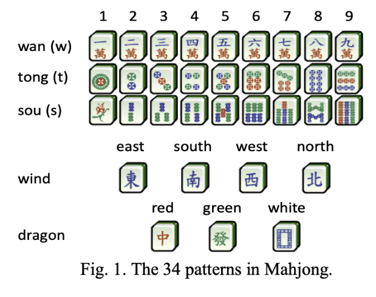
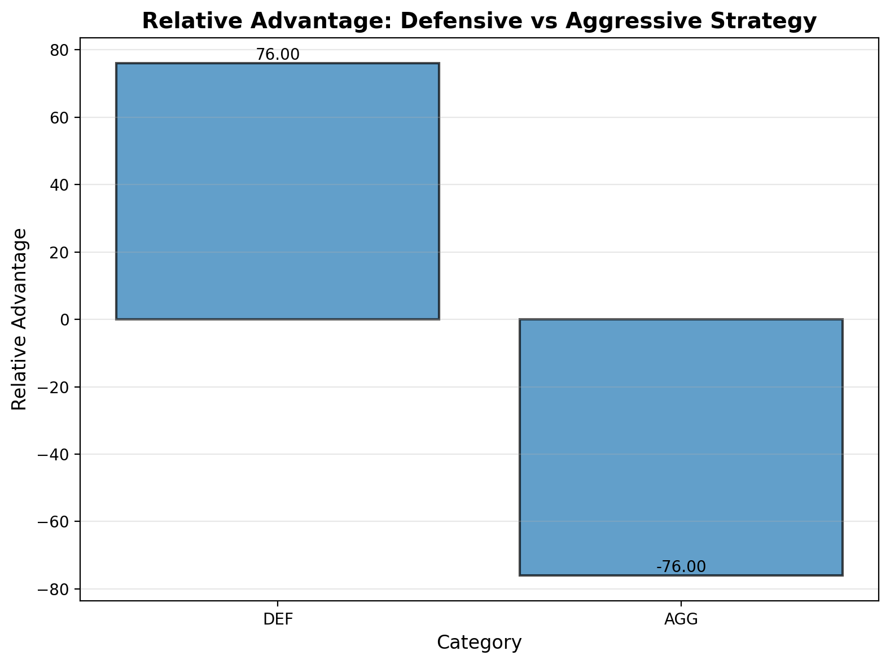
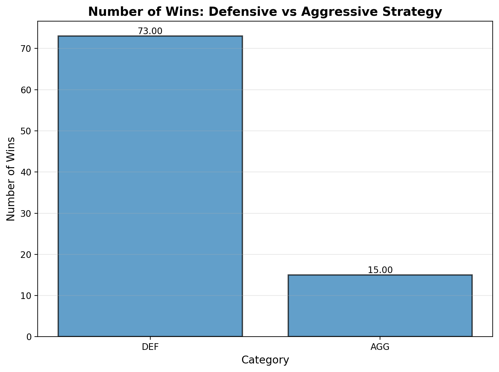
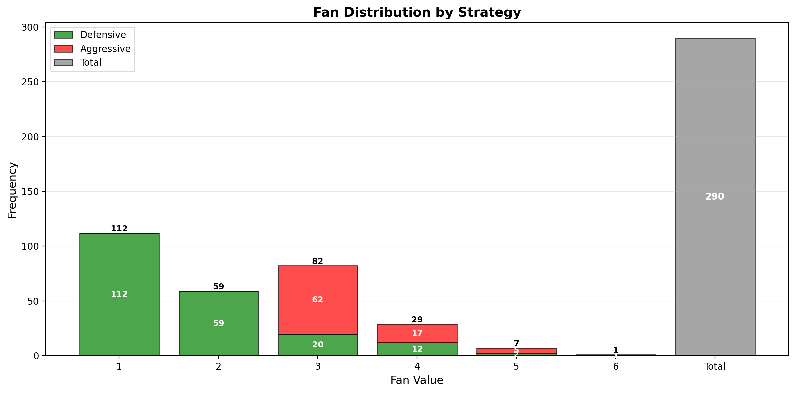
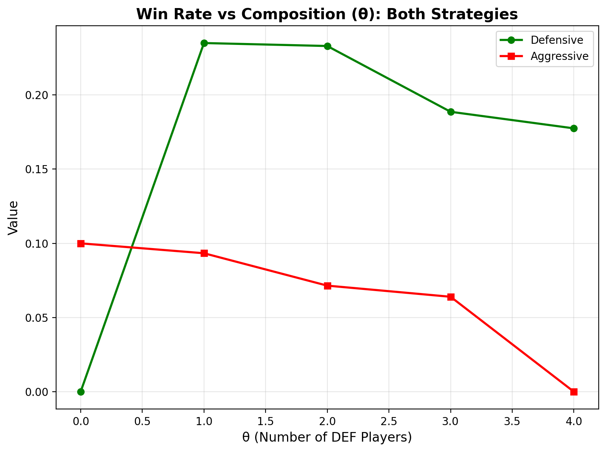
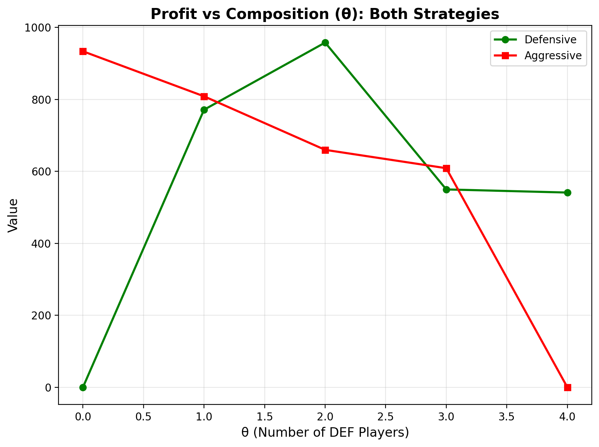
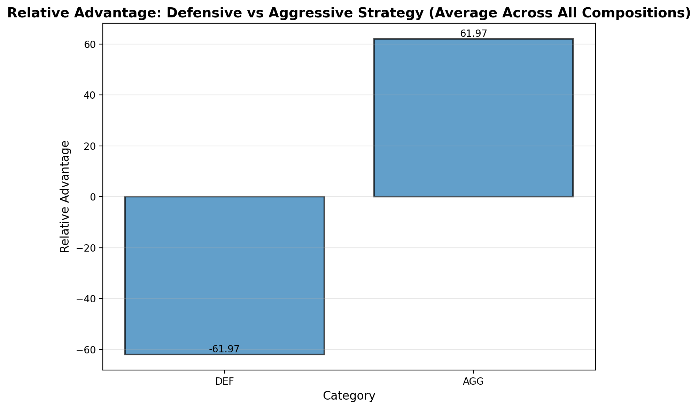
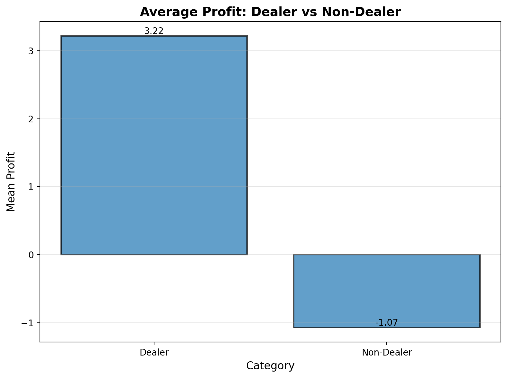
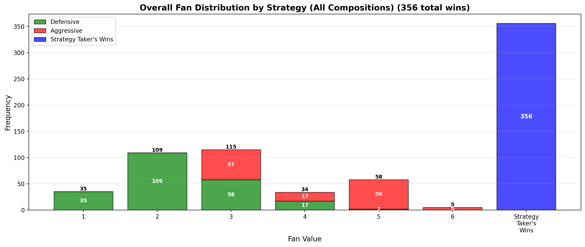

# Monte Carlo Simulation of Strategic Trade-offs in Beijing Mahjong

**Authors:** Xu(Pete) Chen, Bohan Shan  
**NetIDs:** xc74, bohans3  

---

## 🀄 Introduction

Mahjong is a traditional four-player strategy game that blends elements of probability, pattern recognition, and risk–reward decision-making.  
This project focuses on **Beijing-style Mahjong**, a ruleset widely played in northern China.  

Each player begins with **13 tiles** and draws one on each turn, discarding one until achieving a valid **14-tile winning hand (Hu)**.  
A standard winning hand must consist of **four melds (sets)** and **one pair (eyes)**, where melds can be:

- **Pongs** – three identical tiles (e.g., three 5 of Characters)  
- **Chis** – three consecutive tiles of the same suit (e.g., 3–4–5 of Dots)  
- **Gongs** – four identical tiles (a special type of Pung that yields a bonus fan)  
- The **pair (eyes)** is any two identical tiles (e.g., two Red Dragons)

Unlike southern variants such as Sichuan Mahjong that emphasize continuous rounds or “blood battle” mechanics, the **Beijing style** uses a **fan-based scoring system** with independent hands and exponential payoffs determined by the complexity of the winning pattern.

The total score for a winning hand typically follows an exponential relationship:
`Score = B × 2^fan`
where `B` is a fixed base point (e.g., 2 or 4).

---

## 🚀 Getting Started

### Installation

1. Clone the repository
2. Install dependencies:
```bash
pip install -r requirements.txt
```

### Configuration

All simulation parameters are configured in `configs/base.yaml`:

#### Basic Game Parameters

```yaml
base_points: 10              # Base point value for scoring (B in Score = B * 2^fan)
fan_min: 1                  # Minimum fan for defensive strategy (Pi Hu = 1 fan)
t_fan_threshold: 5          # Fan threshold for aggressive strategy (low risk target)
penalty_deal_in: 1          # Deal-in penalty multiplier
rounds_per_trial: 20        # Number of rounds per trial
trials: 50                  # Number of trials to run (more trials provide more stable results but take longer)
```

#### Strategy Thresholds

These parameters control when strategies decide to claim actions (Hu, Gong, Pong, Chi):

```yaml
strategy_thresholds:
  tempo_defender:
    medium_risk_threshold: 0.35     # Risk level to start medium risk behavior (fan >= 1)
    high_risk_threshold: 0.60       # Risk level to start high risk behavior (fan >= 1)
    gong_risk_threshold: 0.35       # Maximum risk to claim Gong
    pong_risk_threshold: 0.5        # Maximum risk to claim Pong
    chi_risk_threshold: 0.35        # Maximum risk to claim Chi
    risk_fan_adjustment: 0.5        # Fan adjustment when accepting high-risk wins
    
  value_chaser:
    medium_risk_threshold: 0.55     # Risk level to start medium risk behavior (fan >= 3)
    bailout_risk_threshold: 0.80     # Risk level to bail out and accept fan >= 1 wins
    chi_risk_threshold: 0.7          # Maximum risk to claim Chi
    chi_wall_threshold: 25           # Minimum wall tiles remaining to claim Chi
    
  neutral_policy:
    target_fan: 3                    # Target fan for low risk (fan >= 3)
    medium_risk_threshold: 0.45      # Risk level to start medium risk behavior (fan >= 2)
    bailout_risk_threshold: 0.70     # Risk level to bail out and accept fan >= 1 wins
```

#### Tile Evaluation Heuristics

These weights control how tiles are evaluated for discard decisions:

```yaml
scoring_weights:
  pair_potential: 3          # Weight for tiles that can form pairs/pongs
  sequence_potential: 0.5    # Weight for tiles that can form sequences (chi)
  honor_value: 0.8           # Base value for honor tiles (Feng/Jian)
  suit_penalty: 2            # Penalty for tiles not matching dominant suit (ValueChaser)
  safety_weight: 0.3         # Weight for safety (tiles already seen in discard pile)
```

#### Hand Completion Evaluation

These weights assess how close a hand is to completion:

```yaml
hand_completion_weights:
  completed_meld: 3.0        # Score for each completed meld (Pong/Chi/Gong)
  pair: 1.5                  # Score for each pair (potential eyes)
  tatsu: 0.8                 # Score for each tatsu (2-tile sequence that can become chi)
  isolated_penalty: -0.5     # Penalty for each isolated tile (no nearby tiles)
```

#### Post-Discard Evaluation

These weights evaluate hand quality after discarding a tile:

```yaml
post_discard_weights:
  isolated_reduction: 2.0    # Bonus for reducing isolated tiles
  structure_clarity: 1.5     # Bonus for improving pairs/tatsu count
  completion_improvement: 1.0 # Bonus for improving overall completion
```

#### Risk Calculation

```yaml
risk_calculation:
  max_denominator: 100       # Denominator for risk calculation (risk = discards / max(denominator, wall + discards))
```

#### Experiment Parameters

```yaml
experiment:
  num_compositions: 5       # Number of table compositions to test
  theta_values: [0, 1, 2, 3, 4]  # Values of theta (number of defensive opponents)
  regression_samples: 100   # Number of samples for regression analysis
```

### Running Experiments

**Run a specific experiment:**
```bash
python main.py --experiment 1    # Strategy comparison
python main.py --experiment 2    # Table composition analysis
```

**Run all experiments (runs experiments 1 and 2):**
```bash
python main.py --all
```

### Running Tests

**Run all tests with coverage:**
```bash
pytest pytest/ --cov=mahjong_sim --cov-report=term-missing --cov-report=html
```

**Run tests without coverage:**
```bash
pytest pytest/ -v
```

**View coverage report:**
```bash
open htmlcov/index.html
```


---

## 📁 Project Structure

```
597PRFINAL/
├── configs/
│   └── base.yaml              # Configuration file for all experiments
├── experiments/
│   ├── run_experiment_1.py   # Strategy comparison experiment
│   └── run_experiment_2_table.py  # Table composition analysis
├── mahjong_sim/
│   ├── __init__.py
│   ├── real_mc.py            # Core Monte Carlo simulation engine
│   ├── scoring.py            # Scoring functions (score, profit, cost)
│   ├── strategies.py         # Strategy classes (TempoDefender, ValueChaser) and interfaces
│   ├── players.py            # Player classes and NeutralPolicy
│   ├── utils.py              # Statistical utilities and comparisons
│   └── plotting.py           # Visualization functions
├── pytest/                    # Test suite
│   ├── test_simulation.py     # Basic simulation tests
│   ├── test_strategies.py    # Strategy function tests
│   ├── test_scoring.py       # Scoring function tests
│   ├── test_players.py       # Player and NeutralPolicy tests
│   ├── test_table.py         # Table simulation tests
│   └── test_utils.py          # Statistical utility tests
├── output/                    # Experiment output files
├── plots/                     # Generated plots and visualizations
├── main.py                    # Main entry point for running experiments
├── pytest.ini                 # Pytest configuration
└── requirements.txt           # Python dependencies
```

---

### Common Fan Sources in Beijing Rules

| **Category** | **Example** | **Fan Value** |
|---------------|-------------|----------------|
| **Basic hand** | Self-draw, Concealed hand, All simples | 1 fan |
| **Common wins** | All pongs, Mixed triple chow | 2 fan |
| **Advanced hands** | Pure flush, Little dragons | 4–6 fan |
| **Add-on bonuses** | Gong +1 fan; "Gong open" win +1 fan | Variable (1–2 fan) |

#### 1. Basic Hand — 1 Fan Each
**(1) Self-draw — 1 fan**  
Definition: You win by drawing the winning tile yourself.  
Requirements:  
- Winning tile must come from your own draw  
- Melds (chi/pong) do not affect this bonus
    
**(2) Concealed hand — 1 fan**  
Definition: You win with a completely closed hand.  
Requirements:  
- No exposed melds  
- Win may be self-draw or discard depending on rule set
  
**(3) All simples — 1 fan**  
Definition: Hand contains no terminals (1 or 9) and no honours(Winds + Dragons).  
Requirements:  
- Tiles must be 2–8 only  
- Melds allowed as long as tiles meet criteria  
#### 2. Common Wins — 2 Fan Each
**(4) All pongs — 2 fan**  
Definition: Hand consists of four pong/gong sets and one pair.  
Requirements:  
- Exposed or concealed allowed  
- Pair may be any tile
  
**(5) Mixed triple chow — 2 fan**  
Definition: Same numbered chi appears in all three suits.  
Example: 4–5–6 in characters(wans), dots(tongs), and bamboos(sous)  
Requirements:  
- Three identical sequences, one in each suit  
#### 3. Advanced Hands — 4–6 Fan Each
**(6) Pure flush — 4–6 fan**  
Definition: Whole hand uses tiles from one suit, no honours(Winds + Dragons).  
Fan range:  
- Exposed melds → lower (4 fan)  
- Fully concealed → higher (6 fan)
   
**(7) Little dragons — 4–6 fan**  
Definition:  
- Two dragon pongs/gongs  
- Pair made from the remaining dragon  
Requirements:  
- Dragon melds may be exposed or concealed  
- Pair must be the third dragon  
#### 4. Add-on Bonuses — +1 to +2 Fan
**(8) Gong — +1 fan**  
Definition: Gong formed by upgrading an existing Pong meld (from self-draw or discard).  
Bonus: +1 fan per gong  

**(9) "Gong open" win — +1 fan**  
Definition: Win on the tile drawn immediately after making a gong.  
Bonus: +1 fan, added on top of gong bonuses  

---

### Pi Hu Rule and Strategy Implications

In our simulation, **Pi Hu with 1 fan is allowed** as the minimum valid winning hand.  
Traditional Beijing rules require at least one fan to declare a win, and our implementation enforces this:  
A structurally complete hand of four melds plus one pair **must have at least 1 fan to win** (0 fan is invalid).  
**Pi Hu (1 fan)** represents the most basic winning hand and is fully allowed.

This creates two key consequences for the simulation:
1. Defensive players can win with **1 fan (Pi Hu)** as soon as they reach this minimum threshold, reducing exposure to deal-in risk.  
2. Aggressive players pursue higher-fan outcomes (typically 3+ fan), choosing to continue drawing rather than accepting 1-fan Pi Hu wins.


---

## ⚙️ Methodology

This project uses a **Monte Carlo simulation** to model and compare long-term outcomes of player strategies under Beijing-style Mahjong rules.  
It does **not** involve any machine learning or predictive modeling; all results are based purely on random sampling and probabilistic reasoning.

---

### Phase 1 – Design

This project implements a **real Monte Carlo simulation** using actual tile-based gameplay mechanics.  
Each simulated round represents a complete hand among four players using a full **136-tile deck** (Wan, Tiao, Tong, Feng, Jian tiles).

**Game Mechanics:**
- **Deal:** Each player receives 13 tiles; dealer receives 14 tiles
- **Draw and Discard:** Players take turns drawing from the wall and discarding tiles
- **Player Actions:** Players can declare **Pong** (triplet from discard), **Gong** (quad, upgraded from Pung), or **Hu** (win)
- **Winning Detection:** Real pattern matching to detect valid winning hands (4 melds + 1 pair)
- **Fan Calculation:** Based on actual hand patterns (triplets, sequences, Gongs, special patterns)

**Scoring:**
Each round yields one or more winning events (self-draw or deal-in win).  
Scoring follows the Beijing Mahjong rule: `Score = B × 2^fan` where `B` is the base unit score and total fan includes bonuses from hand patterns and Gongs.  
Deal-in penalties are subtracted from the losing player's total; self-draws distribute points from all three opponents.  
The **minimum fan requirement** ensures that any hand with `Fan < 1` is invalid and yields no win. **Pi Hu with 1 fan is allowed** and represents the most basic winning hand.

---

### Phase 2 – Experiments

We define two player strategies that make differentiated decisions at each turn:

- **Defensive strategy (TempoDefender):** 
  - **Hu Declaration (three-tier risk system):**
    - **Low risk** (`risk < 0.35`): Pursues `fan >= 2`
    - **Medium risk** (`0.35 ≤ risk < 0.60`): Accepts `fan >= 1`
    - **High risk** (`risk ≥ 0.60`): Accepts `fan >= 1` (bailout)
  - **Claim Decisions:** Rarely claims chi/pong/gong to avoid exposing melds (only when risk is below respective thresholds)
  - **Discard Logic:** 
    - Prioritizes safety: discards safest tiles (most seen in discard pile)
    - Considers hand completion: adjusts aggressiveness based on how close hand is to completion
    - Evaluates post-discard quality: prefers discards that reduce isolated tiles and improve structure
    - Uses dynamic weights: increases safety focus in late game (when wall is low)
    - Considers opponent patterns: moderately uses suit availability information
  
- **Aggressive strategy (ValueChaser):** 
  - **Hu Declaration (three-tier risk system):**
    - **Low risk** (`risk < 0.55`): Pursues `fan >= 5` (target threshold)
    - **Medium risk** (`0.55 ≤ risk < 0.80`): Accepts `fan >= 3`
    - **High risk** (`risk ≥ 0.80`): Accepts `fan >= 1` (bailout)
  - **Claim Decisions:** Willing to claim pong/gong for fan bonuses; can claim chi early if wall has sufficient tiles (`wall_remaining > chi_wall_threshold`)
  - **Discard Logic:**
    - Strongly prioritizes dominant suit retention: heavy penalty for non-dominant suit tiles
    - Actively seeks available suits: prefers tiles from suits opponents are discarding (more available)
    - Considers hand completion: adjusts exploration vs. completion focus dynamically
    - Evaluates post-discard quality: considers structure improvement but prioritizes suit matching
    - Uses dynamic weights: more exploration in early game, more completion focus in late game
    - Less safety-focused: lower safety weight, more risk-tolerant

- **Neutral strategy (NeutralPolicy):** 
  - **Hu Declaration (three-tier risk system):**
    - **Low risk** (`risk < 0.45`): Pursues `fan >= 3`
    - **Medium risk** (`0.45 ≤ risk < 0.70`): Accepts `fan >= 2`
    - **High risk** (`risk ≥ 0.70`): Accepts `fan >= 1` (bailout)
  - **Purpose:** Used as baseline opponents in Experiment 1 (2v2 configuration) to provide a balanced comparison environment
  - **Behavior:** Balanced between DEF and AGG strategies, preventing winning on small fans at low risk

**Key Heuristic Components:**

Both strategies use the following evaluation functions:

1. **Hand Completion Score:** Estimates proximity to winning structure based on:
   - Completed melds (Pong/Chi/Gong already formed)
   - Pairs (potential eyes)
   - Tatsu (2-tile sequences that can become chi)
   - Isolated tiles (penalty for tiles with no nearby tiles)

2. **Dynamic Weight Adjustment:** Weights change based on:
   - Hand completion level (higher completion → more conservative)
   - Round progression (early game → exploration, late game → safety)
   - Wall remaining (primary indicator, 70% weight) + turn number (30% weight)

3. **Opponent Discard Pattern Analysis:** 
   - Tracks opponent discards by suit
   - Suits frequently discarded → more available/safer
   - Suits rarely discarded → less available (higher risk)

4. **Post-Discard Hand Quality Evaluation:**
   - Evaluates hand structure after discarding each tile
   - Prefers discards that reduce isolated tiles
   - Prefers discards that improve structure clarity (pairs/tatsu count)

Each simulation trial consists of **20 rounds** (configurable via `rounds_per_trial`) played among all 4 players, with multiple trials (default: 50) to obtain stable distributions.

| **Experiment** | **Variable Manipulated** | **Purpose** |
|-----------------|--------------------------|-------------|
| 1. Strategy comparison | Compare DEF vs AGG under identical conditions | Test H1 (profit difference) |
| 2. Table composition sweep | Vary proportion of DEF players, theta = 0, 1, 2, 3, 4 | Analyze strategy performance across different table compositions |

---

### Phase 3 – Analysis

Simulation outputs are aggregated across all trials to estimate:

- Expected profit per trial: E(Score)  
- Variance and confidence intervals  
- Win rate, self-draw rate, and deal-in rate  
- Fan distribution (frequency of 1–16 fan outcomes)  
- Risk metrics such as maximum drawdown and ruin probability under a finite bankroll  

Statistical comparisons between strategy types use **two-sample t-tests** and **confidence intervals**.  
For composition analysis, we run a **regression of profit against theta** (the proportion of defensive opponents) to analyze how table composition affects strategy performance.  

All experiments use **modular Python code** and configuration-driven runs via YAML inputs.


---

## 🎯 Hypotheses

**H1:**  
Defensive players, who prioritize winning whenever possible, will achieve higher expected long-term monetary profit than aggressive players, who only win on hands meeting or exceeding a specified fan threshold.

**Experiment 1 Results (2v2 configuration: 2 test players vs 2 neutral players):**

1. **Relative Advantage:** The profit comparison plot shows the relative advantage between defensive and aggressive strategies. Positive values indicate DEF advantage, negative values indicate AGG advantage. We can see that the defensive players are winning more profits than the aggressive players. 
   

2. **Win Rate:** Our simulation results clearly indicate that the defensive strategy is more effective at achieving victories. The win rate for defensive players is significantly higher than that of aggressive players. This is likely because defensive players favor lower-risk opportunities, allowing them to win more quickly and consistently than aggressive players. In this simulated environment, adopting a defensive approach—focused on stability and risk minimization—strongly correlates with a higher frequency of winning rounds.
   

3. **Fan Distribution:** The fan distribution plot illustrates the frequency of wins at different fan values for each strategy, with the title indicating the total number of wins (strategy takers plus neutral players). The plot highlights key differences in how each strategy achieves victories across fan values.
From this plot, we observe that defensive players—who typically avoid high-risk moves to claim a win—still outperform aggressive players overall. Notably, there are even instances where defensive players win with five fan values. We believe this occurs when defensive players begin the game with a high–fan-value tile combination, allowing them to secure a strong win without taking additional risks.
   

**H2:**
The relative performance of aggressive and defensive strategies depends on the composition of opponents at the table. As the proportion of defensive players increases, the expected profit of aggressive players rises, while that of defensive players declines.

**Experiment 2 Results (4-player table composition analysis):**

1. **Win Rate:** 

      Our simulation shows that the number of defensive players does not consistently increase the win rate of defensive players. When there is only one defensive player (θ = 1), the defensive strategy achieves its highest win rate, substantially exceeding that of aggressive players. In this configuration, the defensive player faces no competition from other defensive strategies and can frequently secure early, low-fan wins.

      As the number of defensive players increases to θ = 2 and θ = 3, the win rates of defensive and aggressive players converge. This suggests that competition among multiple defensive players reduces their ability to consistently secure quick wins, narrowing the win-rate advantage. Aggressive players benefit from this reduced pressure at intermediate table compositions, reaching their highest win rate at θ = 3.

      However, this trend does not continue at θ = 4. When all players adopt the defensive strategy, the aggressive player’s win rate drops to zero since no one is aggressive anymore. Overall, while aggressive players’ win rates increase at intermediate levels of defensive competition, defensive players maintain higher win rates whenever they are present, and the relationship between win rate and table composition does not follow a simple increasing pattern.

  

2. **Profit Comparison:** 

      Overall, the profit results show a clear divergence from win-rate outcomes. In general, aggressive players tend to achieve higher expected profit than defensive players in mixed-strategy environments, despite winning fewer rounds. This reflects the impact of the exponential scoring rule, where a small number of high-fan wins can outweigh frequent low-fan victories.

      At a high level, aggressive profit increases as the table becomes more defensive-leaning, reaching a peak in moderately defensive environments, before breaking down in fully defensive tables. This pattern suggests that aggressive strategies benefit from reduced pressure and longer game dynamics, which create opportunities to realize high-value hands, but rely on some degree of strategic diversity to remain effective.

      Defensive players exhibit a more stabilizing profit profile. While they struggle in mixed environments where aggressive players can extract large payouts, their outcomes improve as the table becomes more uniformly defensive. Overall, the profit trend highlights a non-linear trade-off between consistency and payoff magnitude, with strategy performance strongly shaped by the scoring structure rather than win frequency alone.

  
  

3. **Does Dealer matters:** Our results also show that being the dealer (the first player to discard a tile) yields higher profits compared to non-dealers. We believe this is because the dealer starts with 14 tiles while other players start with 13, which creates the possibility for the dealer to win immediately at the beginning of the game if they already have a winning tile combination.
   

4. **Fan Distribution:** The overall fan distribution across all compositions shows that aggressive players achieve higher fan values on average, with more wins at 3+ fan levels. Defensive players, while winning more frequently, tend to win with lower fan values (primarily 1-2 fan). This distribution pattern explains why aggressive players can achieve higher profits despite lower win rates—their wins are worth significantly more due to the exponential scoring system (Score = B × 2^fan).
   

---

## 🀄️ Conclusion

1. In experiment1, Defensive players have a higher win rate and earn more overall. Although aggressive players achieve higher fan values, their much lower win frequency prevents these large hands from translating into higher earnings
2. Aggressive players do not gain an advantage in Experiment 1. The structural weaknesses of the aggressive strategy—low win rate, high missed-Hu rate, and heavy dependence on large hands—outweigh any potential synergy or table-composition advantages.
3. The results change in Experiment 2. Aggressive players earn higher profits as the number of defensive players at the table increases. However, in terms of win rate, defensive players still outperform aggressive players, even though they lose money when competing against aggressive players.

---


## 🧪 Testing

**Test files:**
- `test_simulation.py`: Basic simulation functionality
- `test_strategies.py`: Strategy function tests
- `test_scoring.py`: Scoring function tests
- `test_players.py`: Player and NeutralPolicy tests
- `test_table.py`: Table simulation tests
- `test_utils.py`: Statistical utility tests


---

## 📚 Reference

Chen, J. C., Tang, S. C., & Wu, I. C. (n.d.). *Monte-Carlo simulation for Mahjong.*  
National Yang Ming Chiao Tung University Academic Hub.  
[https://scholar.nycu.edu.tw/en/publications/monte-carlo-simulation-for-mahjong](https://scholar.nycu.edu.tw/en/publications/monte-carlo-simulation-for-mahjong)

*Image from:*  
Chen, J. C., Tang, S. C., & Wu, I. C. (n.d.). *Monte-Carlo simulation for Mahjong.*  
National Yang Ming Chiao Tung University Academic Hub.  
[https://scholar.nycu.edu.tw/en/publications/monte-carlo-simulation-for-mahjong](https://scholar.nycu.edu.tw/en/publications/monte-carlo-simulation-for-mahjong)

We used AI-assisted tools (OpenAI ChatGPT) to support text refinement, structural organization, 
and grammar editing during manuscript preparation. AI tools were not used for generating research ideas, 
analyzing data, conducting experiments, or drawing conclusions. All methodological decisions, analytical 
results, and interpretations were fully developed and validated by us.

---
